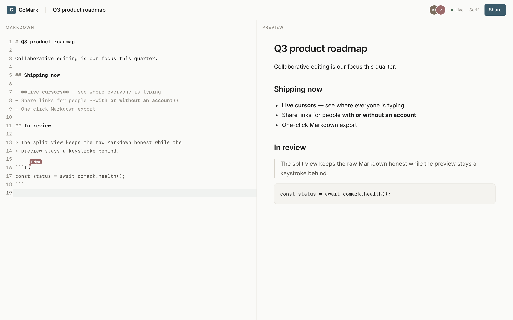
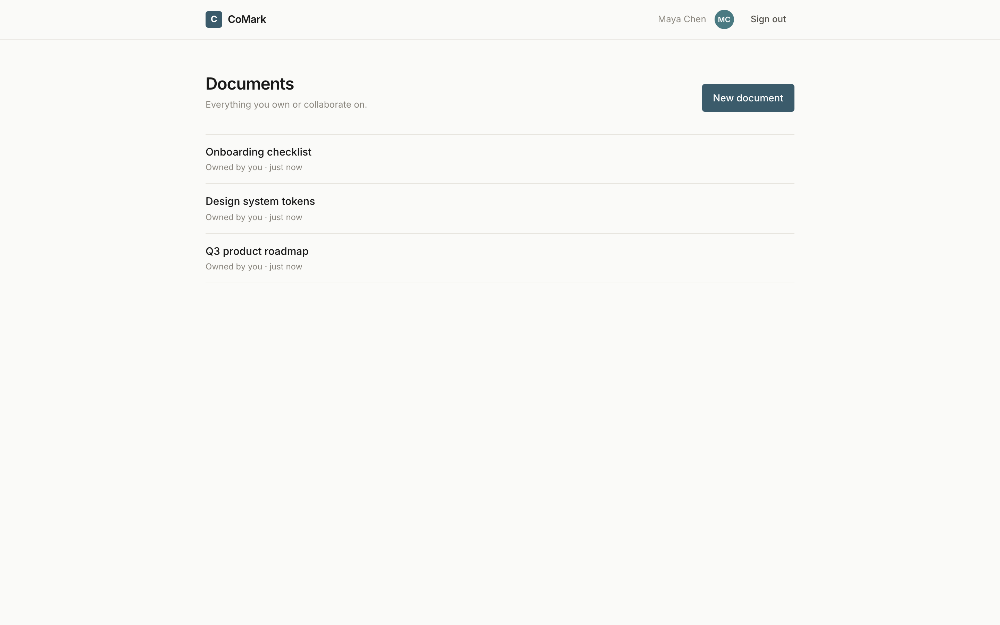
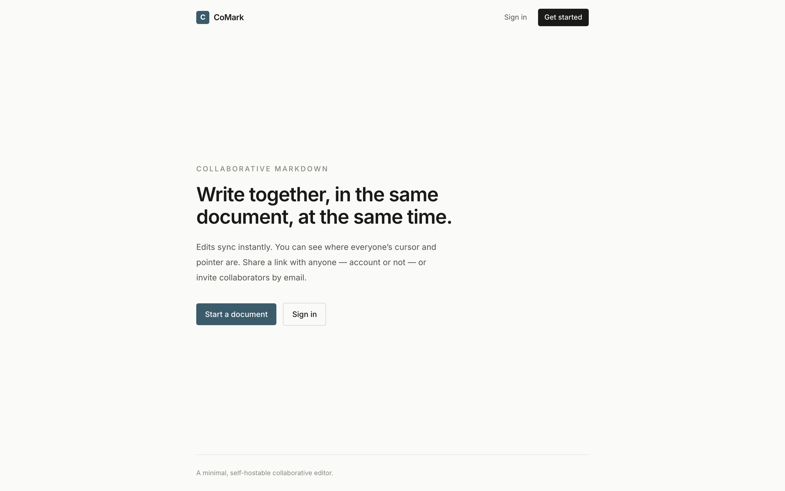

# CoMark

Collaborative Markdown editing with live presence — a resizable split view (raw
Markdown ⇄ preview), remote cursors in the text, and share links for anyone with
or without an account.



## Quick start

```bash
cp .env.example .env
docker compose up --build
```

- App — <http://localhost:8896>
- API docs (Swagger) — <http://localhost:8897/docs>

```bash
make seed   # demo account: demo@comark.app / comark-demo
```

Google sign-in is optional — see [docs/google-oauth.md](docs/google-oauth.md).

|  |  |
|---|---|
|  |  |

## Stack

Next.js 16 · React 19 · Tailwind 4 · Motion · CodeMirror 6 · TanStack Query — talking
to FastAPI · SQLAlchemy 2 · PostgreSQL · Redis, with the realtime engine
(`pycrdt` / Yjs) running **inside** FastAPI. The frontend calls a TypeScript SDK
generated from the API's OpenAPI schema.

## History

Started in 2022 as a small **React + FastAPI** side project. Rebuilt in 2026 with
**agentic coding** (Claude Code) assistance on a modern stack: Next.js 16,
TypeScript, Tailwind CSS 4, Motion, TanStack Query, CodeMirror 6, Yjs / `pycrdt`
CRDT sync, SQLAlchemy 2 (async), Alembic, PostgreSQL, Redis, `@hey-api`
OpenAPI-to-TypeScript codegen, Playwright, pytest, Docker Compose and `uv` —
deployed to Google Cloud Run via GitHub Actions
([setup](docs/deploy-gcp.md) · [how it works, beginner-friendly](docs/google-cloud-explained.md)).

## Development

```bash
make gen-api        # regenerate the typed frontend SDK from the API
make test           # backend tests (pytest)
make test-e2e       # Playwright end-to-end tests (needs the stack running)
make lint           # ruff + mypy + eslint + tsc
```

Run either app on its own with `cp <app>/.env.example <app>/.env` then
`uv run uvicorn app.main:app --reload` (backend) or `npm run dev` (frontend).

## License

MIT
